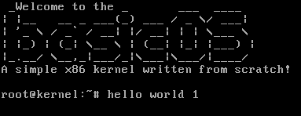

# BasicOS - literally basic

**BasicOS** is a lightweight operating system developed in Assembly x86 (NASM) and C99, tailored for educational purposes.

---



## Features

- **Bootloader**: Includes a 32KB stack.
- **Heap managment**: Malloc and free features.
- **Input**: Basic keyboard input functionality.
- **Output**: Simple screen output functionality.

## Built-in Libraries

- **kstdio.h**: Input/output operations.
- **kstring.h**: String manipulation utilities.
- **kstdlib.h**: Memory and heap management functions, including shutdown (exit).
- **kshell.h**: Basic shell with built-in commands.

## Building and Running

### Prerequisites

Make sure you have the following tools installed:
- NASM (Netwide Assembler)
- GCC (GNU Compiler Collection)
- LD (GNU Linker)

### Build Instructions

1. Clone the repository:
   ```bash
   git clone https://github.com/iyksh/basicOS && cd basicOS
   ```

2. Build the project:
   ```bash
   make
   ```

3. Running with QEMU (Recommended):
   ```bash
   make run
   ```

## Contributing

Contributions are welcome! Feel free to submit a pull request or open an issue to discuss your ideas.

## License

This project is licensed under the GPL3 License. See the [LICENSE](LICENSE) file for more details.

---
